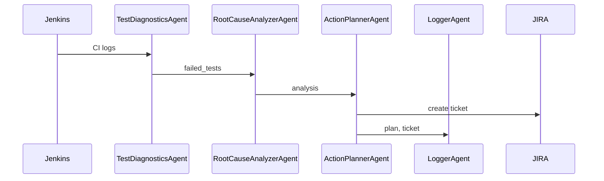

# Multi-Agent QAOps Orchestrator

Automate analysis and remediation of CI/CD failures using a multi-agent system (ADK + Gemini) to reduce MTTR through root-cause analysis, log parsing, and action planning.

## Table of Contents
- Problem
- Goals
- Value
- Requirements
- Runtime
- Setup
- Configuration
- Architecture
- Usage
- Troubleshooting

## Problem
CI/CD pipelines often break due to flaky tests or transient failures needing manual triage, slowing delivery and frustrating engineers.

## Goals
- Ingest CI logs and detect failure patterns.
- Perform root-cause analysis across test suites.
- Produce actionable remediation steps.
- Log actions and raise tickets automatically.

## Value
- Reduced MTTR for QA teams.
- Consistent triage and ticket quality.
- Scalable analysis across pipelines.

## Requirements
- CPU: 2+ cores
- RAM: 4 GB+
- Storage: ~500 MB for project and dependencies
- Python: 3.10+
- Network access to fetch dependencies and CI logs

## Estimated Runtime
- Initial setup: 5–10 minutes (depends on network)
- Pipeline execution: 30–90 seconds per run (log complexity + LLM latency)

## Setup
1. Clone the repository:
    ```bash
    git clone https://github.com/your-org/multi-agent-qaops-orchestrator.git
    cd multi-agent-qaops-orchestrator
    ```
2. Create a virtual environment:
    - macOS/Linux:
      ```bash
      python -m venv venv
      source venv/bin/activate
      ```
    - Windows (Powershell):
      ```powershell
      python -m venv venv
      .\venv\Scripts\Activate.ps1
      ```
3. Install dependencies:
    ```bash
    pip install -r requirements.txt
    ```
4. Run the orchestrator:
    ```bash
    python main_orchestrator.py
    ```

## Configuration
- Set environment variables as needed (examples):
  - GEMINI_API_KEY: LLM access
  - JIRA_URL, JIRA_USER, JIRA_TOKEN: ticket creation
- Optional: configure CI source in tools/jenkins_tool.py for your Jenkins instance.

## Architecture


## Usage
Run the orchestrator on sample logs:
```python
from tools.jenkins_tool import fetch_ci_logs
from main_orchestrator import run_qaops_pipeline

logs = fetch_ci_logs()  # or provide your own CI logs
result = run_qaops_pipeline(logs)
print(result.content)
```

## Troubleshooting
- Virtual environment not activating: ensure correct shell and path.
- API errors: verify GEMINI_API_KEY and network connectivity.
- JIRA auth failures: confirm token scope and project permissions.
- Slow runs: reduce log size or batch analyses.

